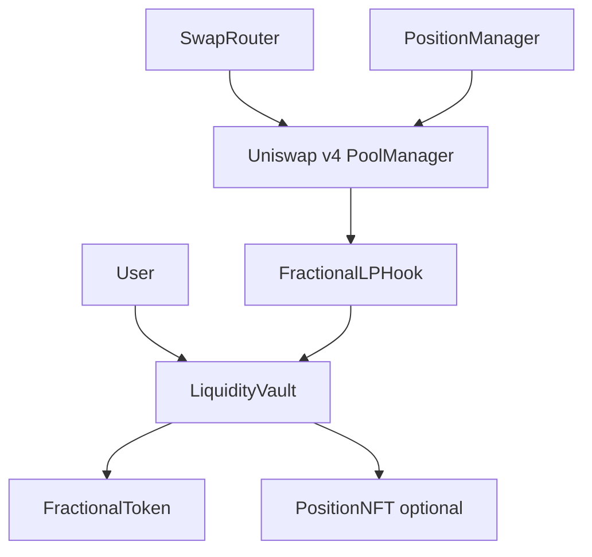

# Non-Fungible LP Positions Hook

**Built on Uniswap v4 · Deployed on Unichain Sepolia**
_Targeting: Uniswap Foundation Prize · Unichain Prize_

> A Uniswap v4 hook + vault primitive that fractionalizes concentrated LP ownership into deterministic ERC20 shares so users can access LP strategy exposure with on-chain accounting guarantees.


## Problem

Concentrated liquidity has strong capital efficiency, but position ownership is fragmented across separate actors and separate positions. Smaller LPs generally cannot aggregate into shared concentrated strategies with deterministic on-chain ownership accounting.

Without a deterministic fractional layer, wrappers often drift between share supply and vault value, especially around first-deposit bootstrapping, rounding boundaries, and fee accrual recognition paths. This creates avoidable accounting risk in addition to normal market risk.

## Solution

This project wraps a concentrated LP strategy behind a vault and mints ERC20 shares for proportional ownership. Users deposit token pairs and receive `FractionalToken` shares. On swap callbacks, the hook forwards fee signals into vault accounting. Users redeem by burning shares for proportional underlying assets.

Core guarantees:

- Hook callbacks are pool-scoped (`PoolId`) and only accepted from `PoolManager`.
- Fee accounting updates are hook-gated (`onlyHook`) in the vault.
- Mint/redeem math is deterministic via `AccountingLibrary`.

## Architecture



## Core Contracts

- `FractionalLPHook`: v4 `beforeSwap`/`afterSwap` callback handler, pool registration, fee-signal forwarding.
- `LiquidityVault`: custody + accounting state machine for deposits, redemptions, fees, losses.
- `FractionalToken`: vault-owned ERC20 shares (`mint`/`burnFrom` onlyOwner).
- `PositionNFT` (optional): ERC721 vault metadata/ownership marker.
- `AccountingLibrary`: pure deterministic math for share issuance, redemption value, and share price.

## Invariants

- `totalVaultValue == totalLiquidity + accumulatedFees`
- `totalShares == FractionalToken.totalSupply()`
- Unregistered pools cannot mutate hook callback state
- Unauthorized callers cannot call hook-only accounting functions

## Deployed Contracts

### Unichain Sepolia (chainId 1301)

| Contract | Address |
|---|---|
| FractionalLPHook | [0xbc395b61ccd210eaa3c0f69d1a2f6bfa7598c0c0](https://sepolia.uniscan.xyz/address/0xbc395b61ccd210eaa3c0f69d1a2f6bfa7598c0c0) |
| LiquidityVault | [0xe9c26cdbb509e1515d06d8eaca74c63e08143977](https://sepolia.uniscan.xyz/address/0xe9c26cdbb509e1515d06d8eaca74c63e08143977) |
| FractionalToken | [0xfCf54F8709423379891B9Fc20BB2e4e8F6daC6Bb](https://sepolia.uniscan.xyz/address/0xfCf54F8709423379891B9Fc20BB2e4e8F6daC6Bb) |
| PositionNFT | [0x39885D60576c08d83E9bc82aAf8767F4411Cc31E](https://sepolia.uniscan.xyz/address/0x39885D60576c08d83E9bc82aAf8767F4411Cc31E) |
| MockToken0 | [0x369b5a33E388a631F056E6a398927008CA4C5660](https://sepolia.uniscan.xyz/address/0x369b5a33E388a631F056E6a398927008CA4C5660) |
| MockToken1 | [0x46cA7A592990a8D7396Dc7d1D761c47C5370993e](https://sepolia.uniscan.xyz/address/0x46cA7A592990a8D7396Dc7d1D761c47C5370993e) |

## Live Demo Evidence (March 15, 2026 UTC)

### Deployment + setup

- Vault deploy: [0x2929e653647378978ecb12e9fba32cbfd61237752cb8f017b0a07e126b0732b7](https://sepolia.uniscan.xyz/tx/0x2929e653647378978ecb12e9fba32cbfd61237752cb8f017b0a07e126b0732b7)
- Hook deploy (CREATE2): [0x593215dea4e55d00de5bc35ce3da7f734c88651a0b403ff7615e399a20dfa4d5](https://sepolia.uniscan.xyz/tx/0x593215dea4e55d00de5bc35ce3da7f734c88651a0b403ff7615e399a20dfa4d5)
- Pool initialize: [0xfd526d6bd41346cb5eeecd6b8bb722cd0497a0f9b5ad12aaf7dc6bc324d5c909](https://sepolia.uniscan.xyz/tx/0xfd526d6bd41346cb5eeecd6b8bb722cd0497a0f9b5ad12aaf7dc6bc324d5c909)
- Hook registerPool: [0x831cf30733074e34b0f970860d931ed6ec741e8d2b331f712e4cfb5bbd44f254](https://sepolia.uniscan.xyz/tx/0x831cf30733074e34b0f970860d931ed6ec741e8d2b331f712e4cfb5bbd44f254)
- Seed liquidity (`modifyLiquidities`): [0x2be67fe86b358f9dab965663d07f86ef879edc860b62b18afb7777b249f8bd21](https://sepolia.uniscan.xyz/tx/0x2be67fe86b358f9dab965663d07f86ef879edc860b62b18afb7777b249f8bd21)

### User lifecycle

- User A deposit: [0x83fe4c785a09676720decf30afde29d131ea5f68f25e410d3c858e5eef2b4d9e](https://sepolia.uniscan.xyz/tx/0x83fe4c785a09676720decf30afde29d131ea5f68f25e410d3c858e5eef2b4d9e)
- User B deposit: [0x20e15a22c8a6ffc0af5f976f041bce8897fc66adb3952ff13d31208f98906abd](https://sepolia.uniscan.xyz/tx/0x20e15a22c8a6ffc0af5f976f041bce8897fc66adb3952ff13d31208f98906abd)
- Swap + fee signal: [0xd071bf2dfa311035c015c5b7113e73fafb52ff0546361cbc03ce7816289b6928](https://sepolia.uniscan.xyz/tx/0xd071bf2dfa311035c015c5b7113e73fafb52ff0546361cbc03ce7816289b6928)
- User A redeem: [0xd97f4df7cfcb9883a0607d58f304a6c09978646709059ffbff9e81691024e7bb](https://sepolia.uniscan.xyz/tx/0xd97f4df7cfcb9883a0607d58f304a6c09978646709059ffbff9e81691024e7bb)

For the complete ordered tx ledger (all setup + all lifecycle txs), see [`docs/demo.md`](./docs/demo.md).

## Running

```bash
# install/pin dependencies
./scripts/bootstrap.sh

# build and test
forge build
forge test -vv

# full Unichain demo (deploy-if-missing + lifecycle)
make demo-testnet
```

```bash
# local flow
anvil
make demo-local
```

## Test Coverage

Scoped protocol coverage:

- Lines: `100.00% (157/157)`
- Statements: `100.00% (186/186)`
- Branches: `100.00% (40/40)`
- Functions: `100.00% (29/29)`

Reproduce:

```bash
forge coverage --report summary --exclude-tests --no-match-coverage "test/|script/|src/mocks/|src/interfaces/|test/utils/|test/invariants/"
```

Test categories:

- Unit tests
- Fuzz tests
- Invariant tests
- Integration tests

## Repository Structure

```text
.
├── src/
├── script/
├── scripts/
├── test/
├── docs/
├── shared/
└── context/
```

## Documentation Index

- [`docs/overview.md`](./docs/overview.md) — system overview.
- [`docs/architecture.md`](./docs/architecture.md) — contract architecture and call flow.
- [`docs/fractional-model.md`](./docs/fractional-model.md) — accounting model and formulas.
- [`docs/security.md`](./docs/security.md) — threat model, mitigations, and residual risks.
- [`docs/deployment.md`](./docs/deployment.md) — deployment environment and scripts.
- [`docs/demo.md`](./docs/demo.md) — complete transaction proof chain.
- [`docs/api.md`](./docs/api.md) — external contract API surface.
- [`docs/testing.md`](./docs/testing.md) — test strategy and commands.

## Key Design Decisions

**Why one-shot `setHook`?**  
Hook assignment is intentionally immutable after first set to reduce governance and reconfiguration risk.

**Why hook-gated fee accrual writes?**  
`recordAccruedFees` is restricted to configured hook address so user/EOA calls cannot mutate fee state.

**Why separate token and vault modules?**  
Share issuance logic remains auditable and isolated from custody logic while preserving strict ownership control.

## Roadmap

- [x] Unichain Sepolia deployment and live proof-chain
- [x] 100% scoped coverage across core contracts
- [ ] External audit and hardened production release
- [ ] Permissionless vault factory for multi-strategy expansion

## License

MIT
