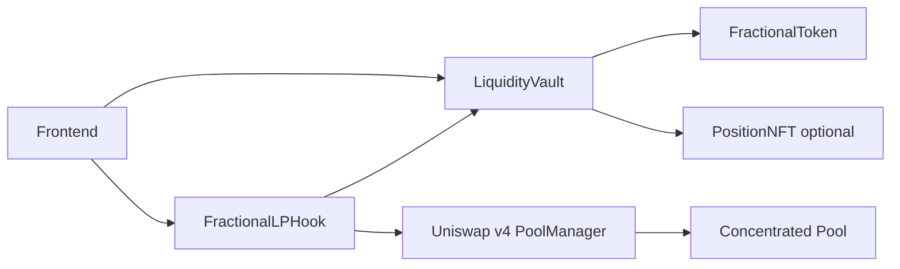
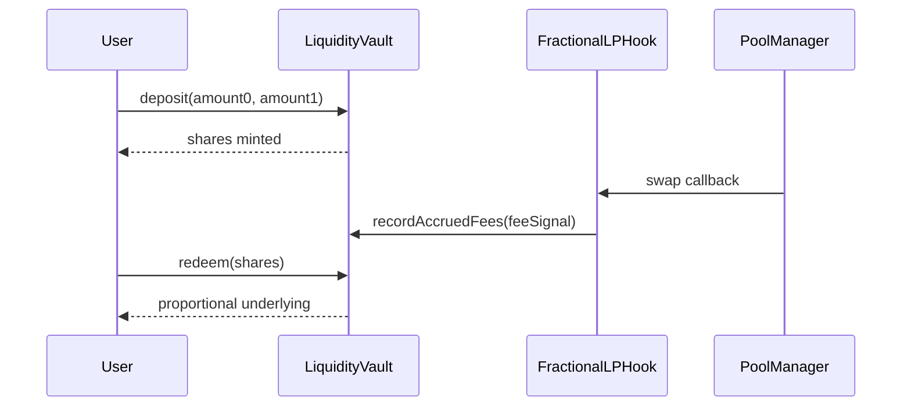

# Non-Fungible LP Positions Hook: Fractionalized Liquidity Ownership


## Problem

Concentrated liquidity positions are capital-inefficient for retail participants when the position is owned as one NFT with one owner and one strategy envelope.

## Solution

This monorepo implements a Uniswap v4 hook + vault primitive that fractionalizes concentrated LP ownership into fungible shares.

- A single vault strategy controls LP posture.
- Users deposit assets and receive ERC20 fractional ownership shares.
- Fee accrual raises vault value, not share count.
- Users redeem shares for proportional claim on current vault value.

No keepers, bots, or reactive orchestration are used.

## Repository Structure

- `src/` smart contracts
- `test/` unit, fuzz, invariant, integration tests
- `script/` Foundry deploy/demo scripts
- `scripts/` bootstrap/integrity/commit utility scripts
- `frontend/` LP console
- `shared/` ABIs + shared schema
- `docs/` technical docs
- `context/` external references (`uniswap`, `unchain`, optional `atrium`)

## Contracts

- `FractionalLPHook`: Uniswap v4 swap hook integration + fee signal routing.
- `LiquidityVault`: deterministic accounting, mint/redeem, fee/loss tracking.
- `FractionalToken`: ERC20 ownership shares.
- `PositionNFT` (optional): ERC721 ownership marker for vault instance context.
- `AccountingLibrary`: deterministic math for mint/burn/share pricing.

## Architecture



## Fractionalization Lifecycle



## Quickstart

### 1) Bootstrap dependencies

```bash
./scripts/bootstrap.sh
```

### 2) Build and test

```bash
forge build
forge test -vv
```

### 3) Run local demo

```bash
anvil
make demo-local
```

### 4) Frontend demo

```bash
cd frontend
python3 -m http.server 4173
```

## Dependency Determinism

- Uniswap `v4-periphery` is pinned to commit `3779387e5d296f39df543d23524b050f89a62917`.
- `foundry.lock` and `package-lock.json` are committed.
- CI enforces `scripts/verify_dependency_integrity.sh`.

## Demo Targets

- `make demo-local`
- `make demo-testnet`
- `make demo-fractional`

## Judge-Friendly Demo Narrative

1. Deploy mock tokens, pool manager artifacts, hook, and vault.
2. User A deposits and receives shares.
3. User B deposits and receives shares.
4. Swap executes, hook records fee signal.
5. User A redeems shares and exits at increased value.
6. Console outputs value-before/value-after and swap deltas.

## Security Notes

- Access controls and `onlyHook` enforcement are explicit.
- Reentrancy protections are applied to external value-moving paths.
- Invariant and fuzz testing enforce accounting consistency.
- This is not claimed attack-proof; independent audit is required before mainnet use.

## Documentation Index

- [Overview](./docs/overview.md)
- [Architecture](./docs/architecture.md)
- [Fractional Model](./docs/fractional-model.md)
- [Security](./docs/security.md)
- [Deployment](./docs/deployment.md)
- [Demo](./docs/demo.md)
- [API](./docs/api.md)
- [Testing](./docs/testing.md)
- [Frontend](./docs/frontend.md)

## Mainnet Readiness

If deployed to mainnet, use multisig governance and external security audit prior to launch.
