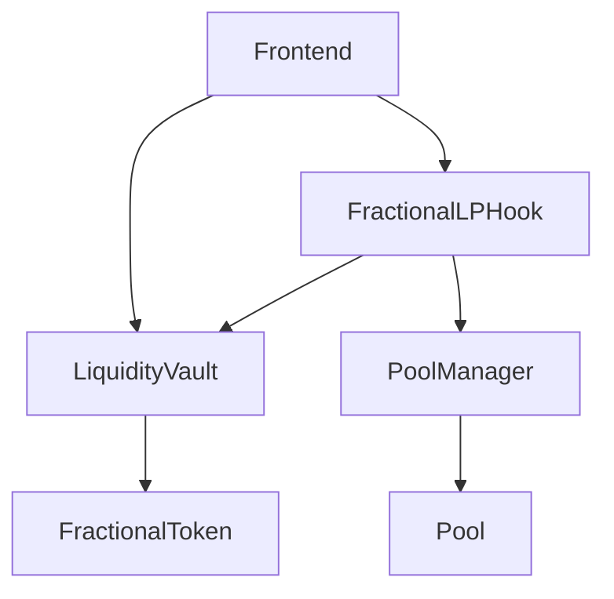

# Architecture

## Components

- `FractionalLPHook`: Uniswap v4 swap callback integration.
- `LiquidityVault`: share mint/burn and accounting core.
- `FractionalToken`: fungible ownership claims.
- `PositionNFT`: optional vault ownership metadata.

## Interaction Diagram

