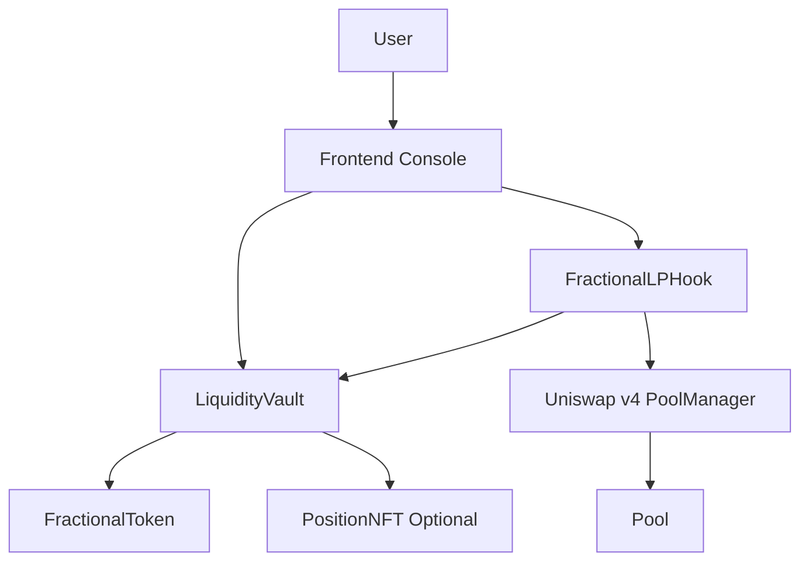
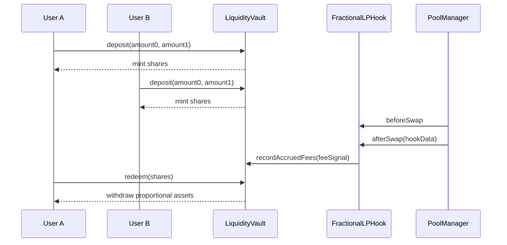

# Non-Fungible LP Positions Hook Specification

## Objective

Enable concentrated LP strategy access through deterministic fractional ownership.

The system wraps a single Uniswap v4 concentrated liquidity posture inside a vault and mints ERC20 share tokens representing proportional ownership of the vault value.

## Scope

- Uniswap v4 hook (`FractionalLPHook`) with `beforeSwap` and `afterSwap`
- Vault (`LiquidityVault`) with deterministic accounting
- ERC20 ownership layer (`FractionalToken`)
- Optional ERC721 ownership metadata (`PositionNFT`)
- Demo UI and scripts for lifecycle simulation

## Core Invariants

1. `totalVaultValue = totalLiquidity + accumulatedFees`
2. `totalShares == FractionalToken.totalSupply()`
3. `sharePriceX96 > 0`
4. Redeem cannot burn more shares than holder balance
5. Hook accounting updates can only be called by configured hook address

## Vault State

```solidity
struct VaultState {
    uint256 totalShares;
    uint256 totalLiquidity;
    uint256 accumulatedFees;
    uint256 sharePriceX96;
    uint256 lastUpdateBlock;
}
```

## Deterministic Math

Let:

- `depositValue = amount0 + amount1`
- `totalVaultValue = totalLiquidity + accumulatedFees`

### Mint

`sharesMinted = depositValue * totalShares / totalVaultValue`

Bootstrap condition:

If `totalShares == 0` or `totalVaultValue == 0`, then `sharesMinted = depositValue`.

### Burn

`withdrawAmount = sharesBurned * totalVaultValue / totalShares`

### Share Price

`sharePriceX96 = totalVaultValue * 2^96 / totalShares`

`sharePriceX96 = 2^96` when `totalShares == 0`.

## Hook Interaction Model

`FractionalLPHook` does three things:

1. Verifies the pool is registered.
2. Tracks swap call counters.
3. Accepts fee signals from swap hook data and forwards fee accounting update to the vault.

No keepers, bots, or reactive services are required.

## Component Diagram



## Lifecycle Diagram



## Threat Model Summary

### Attacks Considered

- share inflation on first deposits
- sandwich around deposit windows
- hook spoofing by non-hook callers
- rounding arbitrage and dust extraction
- malicious redemption ordering
- accounting drift between balance reality and fee signals

### Mitigations

- first depositor bootstrap logic and denominator checks
- strict hook caller gate (`onlyHook`)
- reentrancy guard on external value-moving methods
- deterministic integer math with explicit guards
- invariant and fuzz coverage over share/value conservation

### Residual Risks

- fee signals are trusted by vault; mis-signaling can misprice shares
- this repo demonstrates model correctness, not complete market risk protection

Mainnet deployment must be independently audited.
